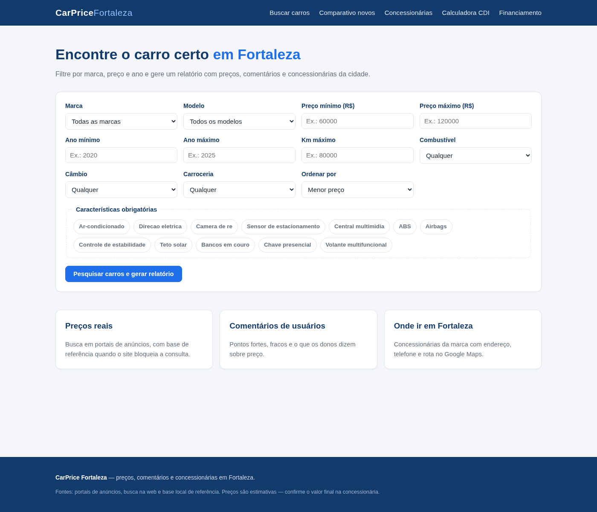
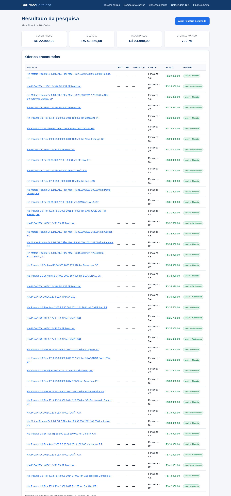
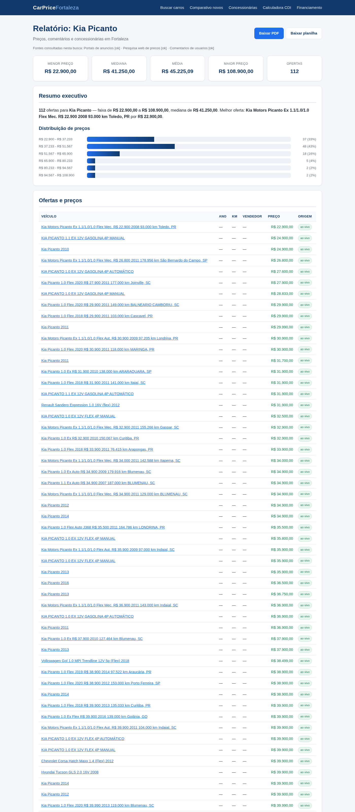
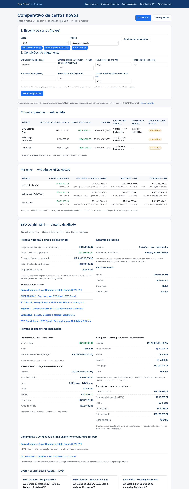
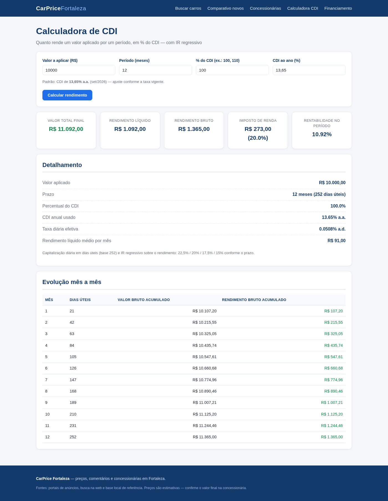
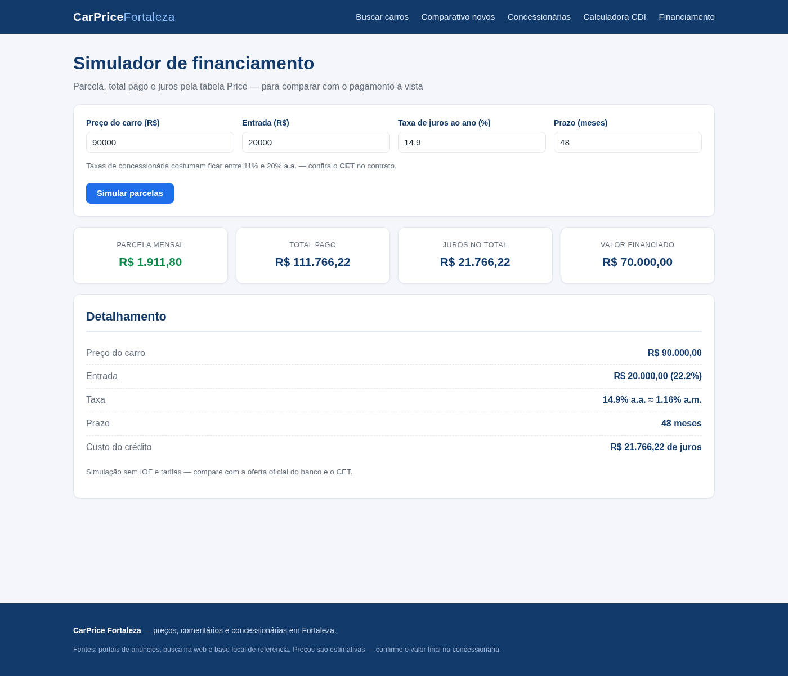
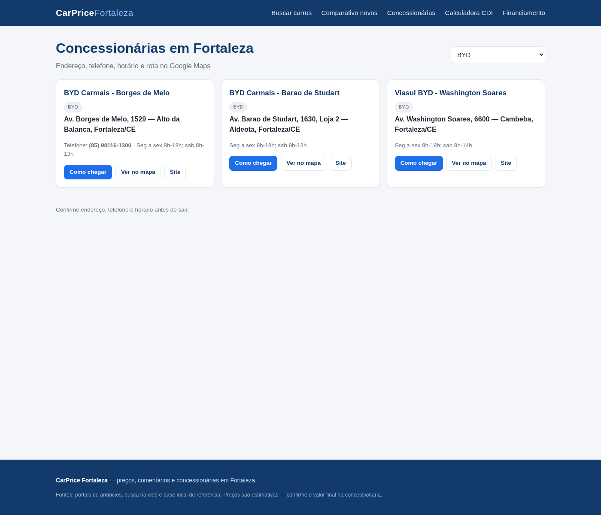

# CarPrice Fortaleza

Aplicação web (Flask) que pesquisa preços de carros usados e novos em Fortaleza–CE, compara ofertas, simula financiamento/CDI e indica a concessionária mais próxima — com relatório detalhado e tabela lado a lado.



---

## Índice

- [O que a ferramenta faz](#o-que-a-ferramenta-faz)
- [Resultados](#resultados)
- [Como executar](#como-executar)
  - [Requisitos](#requisitos)
  - [Modo local](#modo-local)
  - [Com Docker](#com-docker)
  - [Variáveis de ambiente](#variáveis-de-ambiente)
- [Rotas disponíveis](#rotas-disponíveis)
- [Testes](#testes)
- [Estrutura do projeto](#estrutura-do-projeto)

---

## O que a ferramenta faz

| Recursos | Descrição |
|---|---|
| **Busca de ofertas** | Consulta 5 portais de anúncios (Webmotors, Napista, Seminovos BH, iCarros, Mobiauto) em paralelo, com cache local e fallback para base de referência quando o portal bloqueia a automação |
| **Relatório detalhado** | Estatísticas (menor preço, mediana, média, desvio), distribuição de preços em faixas, tabela de ofertas, comentários de usuários e métodos de compra |
| **Exportação** | Relatório e comparativo baixáveis em **PDF** organizado (seções numeradas) e **planilha XLSX** (abas de resumo, ofertas, concessionárias, comentários) |
| **Comparativo de novos** | Tabela lado a lado de até 6 modelos: preço à vista × preço de tabela, economia, garantia e 3 cenários de parcelamento (à vista, com juros, sem juros e consórcio) com a mesma entrada |
| **Simuladores** | Financiamento pela tabela Price e calculadora de CDI com capitalização diária e IR regressivo |
| **Concessionárias** | 44 lojas de Fortaleza com endereço, telefone, horário e botão de rota no Google Maps |
| **Filtros** | Marca, modelo, faixa de preço, ano, km, combustível, câmbio, carroceria e características obrigatórias — com relaxamento automático para o relatório nunca ficar vazio |

---

## Resultados

### 1. Busca de ofertas com estatísticas

Cards com menor preço, mediana, maior preço e contagem de ofertas ao vivo, seguidos da tabela completa com link para o anúncio:



### 2. Relatório detalhado

Resumo executivo, distribuição de preços por faixa (gráfico de barras) e tabela de ofertas com origem de cada dado:



### 3. Download em PDF e planilha

Os botões **Baixar PDF** e **Baixar planilha** no topo do relatório e do comparativo geram arquivos organizados, prontos para imprimir, anexar ou analisar na planilha:

| Arquivo | Rota | Conteúdo |
|---|---|---|
| PDF do relatório | `/relatorio/<id>/pdf` | Capa com data e ID, resumo executivo, distribuição de preços, tabela de ofertas, comparativo da marca, comentários, preços citados na web, concessionárias e dicas — com numeração de páginas |
| Planilha do relatório | `/relatorio/<id>/xlsx` | 6 abas: **Resumo**, **Ofertas** (com filtros automáticos e links), **Concessionárias**, **Comparativo da marca**, **Comentários**, **Menções web** |
| PDF do comparativo | `/comparativo/<id>/pdf` | Preços e garantia lado a lado, parcelas dos 4 cenários, ficha detalhada de cada carro, onde negociar em Fortaleza e dicas |
| Planilha do comparativo | `/comparativo/<id>/xlsx` | 5 abas: **Resumo** (condições), **Preços**, **Parcelas**, **Detalhes**, **Concessionárias** |

Valores em moeda (`R$ #,##0,00`), cabeçalhos com filtro, links clicáveis e larguras já formatadas.

### 4. Comparativo de carros novos — tabela lado a lado

Preço de tabela × preço à vista × economia, com garantia de veículo e bateria:

| Veículo | Preço loja virtual/tabela | Preço à vista real | Economia | Garantia do veículo | Garantia da bateria |
|---|---:|---:|---:|---|---|
| BYD Dolphin Mini | R$ 118.990,00 | **R$ 109.990,00** | R$ 9.000,00 (7,6%) | 6 anos | 8 anos ou 160.000 km |
| Volkswagen Polo Track | R$ 96.690,00 | **R$ 89.990,00** | R$ 6.700,00 (6,9%) | 3 anos | — |
| Kia Picanto | R$ 84.990,00 | **R$ 81.600,00** | R$ 3.390,00 (4,0%) | 3 anos | — |

Parcelas com a mesma entrada (R$ 20.000,00):

| Veículo | À vista (sem juros) | Com juros — 14,9% a.a. em 48x | Sem juros — 12x | Consórcio — 60x |
|---|---:|---:|---:|---:|
| BYD Dolphin Mini | R$ 109.990,00 | R$ 2.457,75/mês | R$ 7.499,17/mês | R$ 2.016,48/mês |
| Volkswagen Polo Track | R$ 89.990,00 | R$ 1.911,52/mês | R$ 5.832,50/mês | R$ 1.649,82/mês |
| Kia Picanto | R$ 81.600,00 | R$ 1.682,38/mês | R$ 5.133,33/mês | R$ 1.496,00/mês |



### 5. Simuladores — CDI e financiamento

**Calculadora de CDI** (12 meses, 100% do CDI, CDI 13,65% a.a.):

| Indicador | Valor |
|---|---:|
| Valor total final | **R$ 11.092,00** |
| Rendimento líquido | R$ 1.092,00 |
| Imposto de renda | R$ 273,00 (20,0%) |
| Rentabilidade no período | 10,92% |

**Financiamento** (R$ 90.000,00, entrada R$ 20.000,00, 14,9% a.a., 48 meses):

| Indicador | Valor |
|---|---:|
| Parcela mensal | **R$ 1.911,80** |
| Total pago | R$ 111.766,22 |
| Juros no total | R$ 21.766,22 |





### 6. Concessionárias em Fortaleza

Endereço, telefone, horário e botões de rota ("Como chegar" e "Ver no mapa"):



---

## Como executar

### Requisitos

- **Python 3.10+** (o `Dockerfile` usa 3.12)
- `pip`
- Opcional: **Docker** + **Docker Compose** para rodar em contêiner

### Modo local

```bash
# 1. clone e entre no projeto
git clone <url-do-repositorio>
cd CarPriceFortaleza

# 2. crie e ative um ambiente virtual
python3 -m venv .venv
source .venv/bin/activate

# 3. instale as dependências
pip install -r requirements.txt

# 4. execute
python3 run.py
```

Acesse **http://localhost:5001**

> A porta padrão mudou de 5000 para **5001** porque a 5000 estava ocupada por outro
> processo na máquina. Para usar outra porta, basta definir a variável `PORT` (veja abaixo).

```bash
PORT=8080 python3 run.py          # sobe em http://localhost:8080
FLASK_DEBUG=0 python3 run.py      # sem recarga automática e debugger
```

### Com Docker

**Opção A — Docker Compose (recomendada):**

```bash
docker compose up --build
```

Acesse **http://localhost:5001** (a porta 5000 do contêiner é mapeada para a 5001 da máquina).

**Opção B — Docker "cru":**

```bash
docker build -t carprice .
docker run -p 5001:5000 --name carprice carprice
```

**Comandos úteis:**

```bash
docker compose logs -f      # acompanha os logs
docker compose down          # para o contêiner
docker compose up --build    # reconstrói após mudanças no código
```

O cache de buscas fica em um **volume nomeado** (`cache`), então os resultados persistem entre reinícios do contêiner. O build exclui `.git`, `tests` e o cache via `.dockerignore`.

### Variáveis de ambiente

| Variável | Padrão (local) | Padrão (Docker) | Descrição |
|---|---|---|---|
| `PORT` | `5001` | `5000` | Porta do servidor Flask |
| `HOST` | `127.0.0.1` | `0.0.0.0` | Endereço de escuta (`0.0.0.0` é necessário dentro do contêiner) |
| `FLASK_DEBUG` | `1` (ativado) | `0` (desativado) | Modo debug: recarga automática e debugger |
| `SECRET_KEY` | `carprice-dev-key` | definido no compose | Chave de sessão do Flask — defina a sua em produção |

---

## Rotas disponíveis

| Rota | Método | Descrição |
|---|---|---|
| `/` | GET | Página inicial com o formulário de busca |
| `/buscar` | GET/POST | Executa a busca e mostra a tabela de ofertas com estatísticas |
| `/relatorio/<id>` | GET | Relatório detalhado da busca (persiste em disco) |
| `/relatorio/<id>/pdf` | GET | Relatório em PDF organizado (download) |
| `/relatorio/<id>/xlsx` | GET | Relatório em planilha Excel (download) |
| `/comparativo` | GET/POST | Formulário e geração do comparativo de até 6 carros novos |
| `/comparativo/<id>` | GET | Comparativo salvo (link permanente) |
| `/comparativo/<id>/pdf` | GET | Comparativo em PDF organizado (download) |
| `/comparativo/<id>/xlsx` | GET | Comparativo em planilha Excel (download) |
| `/cdi` | GET/POST | Calculadora de rendimento de CDI com IR regressivo |
| `/financiamento` | GET/POST | Simulação de parcelas pela tabela Price |
| `/concessionarias` | GET | Lista de concessionárias, com filtro por marca (`?marca=BYD`) |

---

## Testes

```bash
python3 -m pytest -q
```

**54 testes** cobrindo busca/filtros, estatísticas, relatório, comparativo, exportação em PDF/planilha, CDI, simulador de financiamento e configuração dos scrapers:

| Arquivo | Testes |
|---|---:|
| `tests/test_comparativo.py` | 13 |
| `tests/test_report.py` | 11 |
| `tests/test_search.py` | 9 |
| `tests/test_portais.py` | 8 |
| `tests/test_exports.py` | 7 |
| `tests/test_cdi.py` | 6 |

---

## Estrutura do projeto

```
CarPriceFortaleza/
├── run.py                     # ponto de entrada (porta/host via variáveis de ambiente)
├── Dockerfile                 # imagem de produção (python:3.12-slim, usuário não-root)
├── docker-compose.yml         # serviço web + volume de cache
├── requirements.txt           # flask, requests, beautifulsoup4, reportlab, openpyxl, pytest
│
├── app/
│   ├── __init__.py            # factory create_app()
│   ├── routes.py              # rotas HTTP (busca, relatório, comparativo, downloads)
│   ├── services/              # regras de negócio
│   │   ├── search.py          # orquestração da busca e filtros
│   │   ├── report.py          # relatório detalhado
│   │   ├── comparativo.py     # comparativo lado a lado
│   │   ├── exports.py         # exportação em PDF (reportlab) e XLSX (openpyxl)
│   │   ├── payments.py        # métodos de compra + tabela Price
│   │   └── cdi.py             # cálculo de CDI com IR regressivo
│   ├── scrapers/              # coleta de dados
│   │   ├── base.py            # fetch com cache/retry + extração de ofertas
│   │   ├── marketplaces.py    # 5 portais de anúncios
│   │   ├── websearch.py       # DuckDuckGo + Bing
│   │   └── opinions.py        # comentários de usuários
│   └── data/                  # catálogo (24 marcas, 115 modelos) e concessionárias
│
├── templates/                 # páginas Jinja2
├── static/                    # CSS e JavaScript
├── tests/                     # 54 testes pytest
└── docs/screenshots/          # imagens usadas neste README
```

---

## Fontes e limitações

- **Portais de anúncios:** Webmotors, Napista, Seminovos BH, iCarros, Mobiauto — quando bloqueiam a automação, o sistema usa a base local de referência e sinaliza a origem de cada dado no relatório.
- **Preços de referência são estimativas**; confirme o valor final na concessionária.
- **Endereços e telefones** devem ser confirmados por telefone antes do deslocamento.
- Buscas e relatórios ficam salvos em `app/data/cache/` com TTL de 2 horas.
